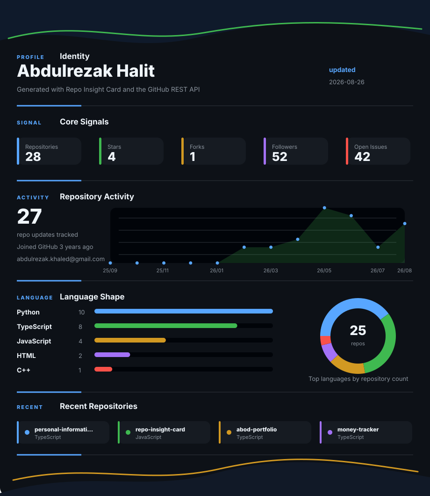

# Repo Insight Card

A small GitHub integration that generates a public profile/repository insight card using the GitHub REST API and GitHub Actions.

<!-- repo-insight-card:start -->
## GitHub Insight Card

This section is generated by **Repo Insight Card**, a real GitHub REST API integration.

### How to use
1. Add the generated marker block to the file you want updated.
2. Set `GITHUB_USERNAME` or `GITHUB_REPOSITORY_OWNER`, and `README_PATH` if the target file is not the default README.
3. Run `npm run generate` locally or let GitHub Actions refresh the section for you.

Generated: 2026-09-12T10:53:56.894Z

| Metric | Value |
| --- | ---: |
| Public repositories analyzed | 28 |
| Source repositories | 27 |
| Stars | 4 |
| Forks | 1 |
| Open issues | 42 |
| Followers | 53 |

**Top languages:** Python (10), TypeScript (8), JavaScript (4), HTML (2), C++ (1)

**Top topics:** No topics yet

| Recently updated repositories | Description | Language | Stars | Forks |
| --- | --- | --- | ---: | ---: |
| [repo-insight-card](https://github.com/Abdulrezak-halid/repo-insight-card) | No description provided. | JavaScript | 0 | 0 |
| [personal-information-dashboard](https://github.com/Abdulrezak-halid/personal-information-dashboard) | No description provided. | TypeScript | 1 | 0 |
| [abod-portfolio](https://github.com/Abdulrezak-halid/abod-portfolio) | No description provided. | TypeScript | 0 | 0 |
| [ai-snake-game](https://github.com/Abdulrezak-halid/ai-snake-game) | A collection of two snake games built with Python - featuring both a hand-tracking AI version using computer vision and a classic keyboard-controlled version. | Python | 0 | 0 |
| [data-mining](https://github.com/Abdulrezak-halid/data-mining) | Data Mining Project | Python | 0 | 0 |
<!-- repo-insight-card:end -->

